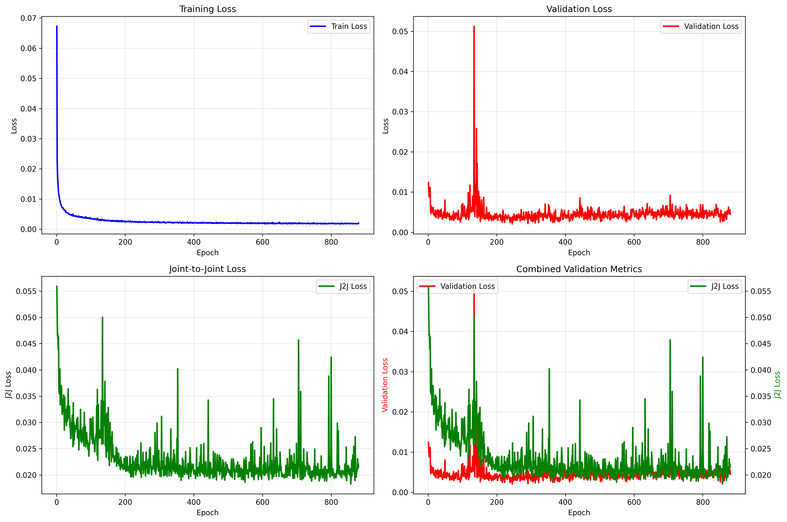
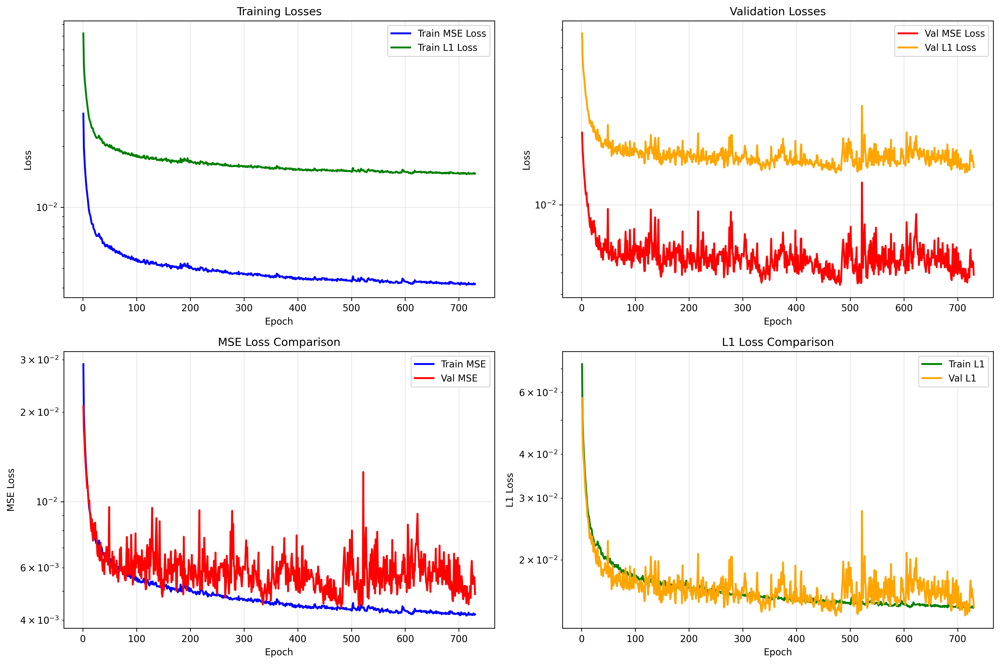
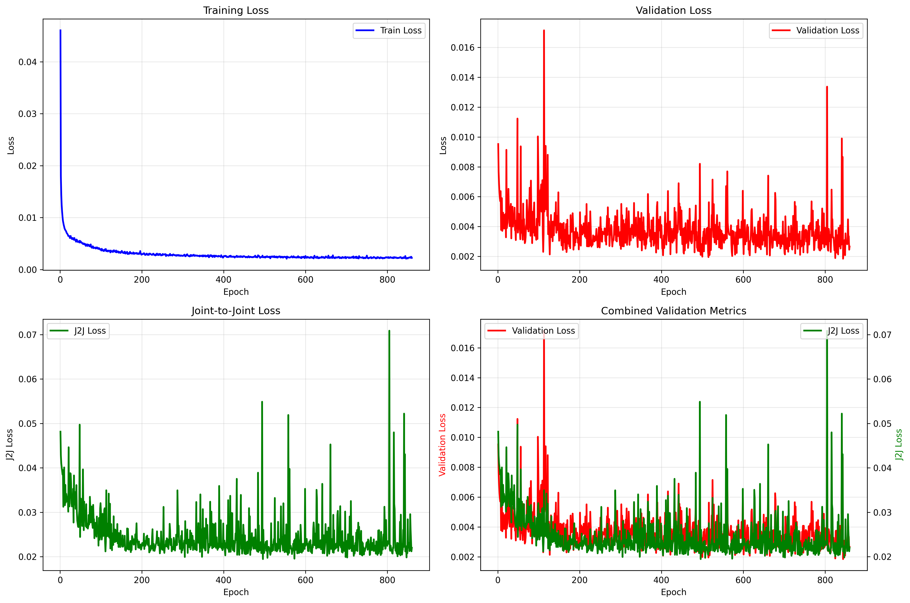
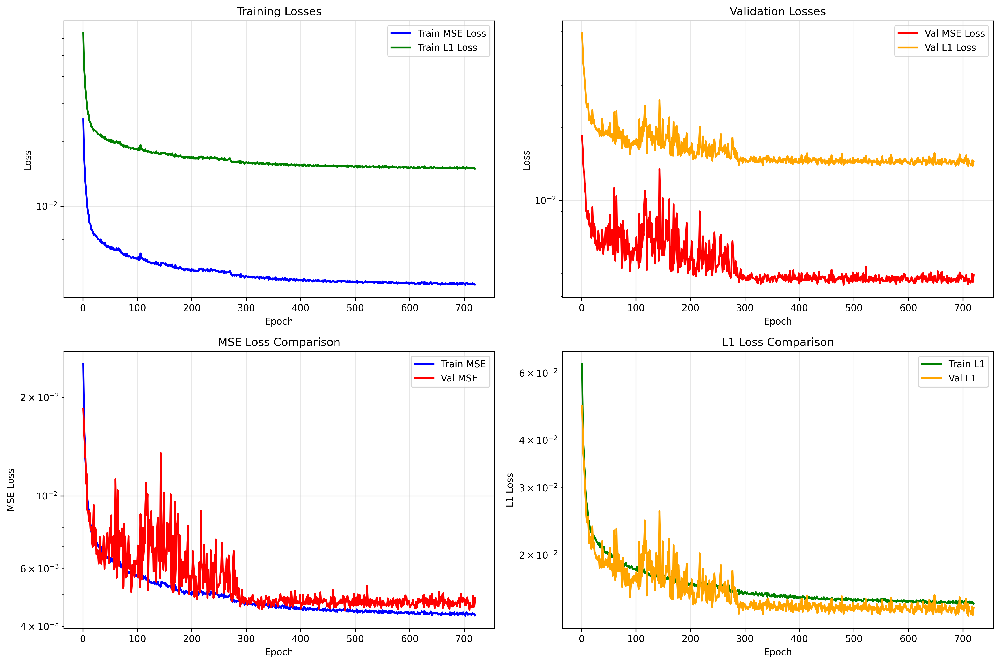
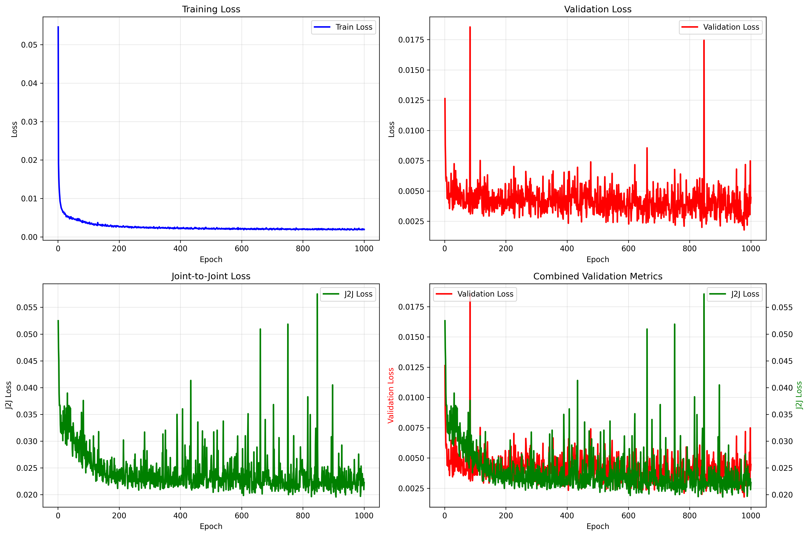
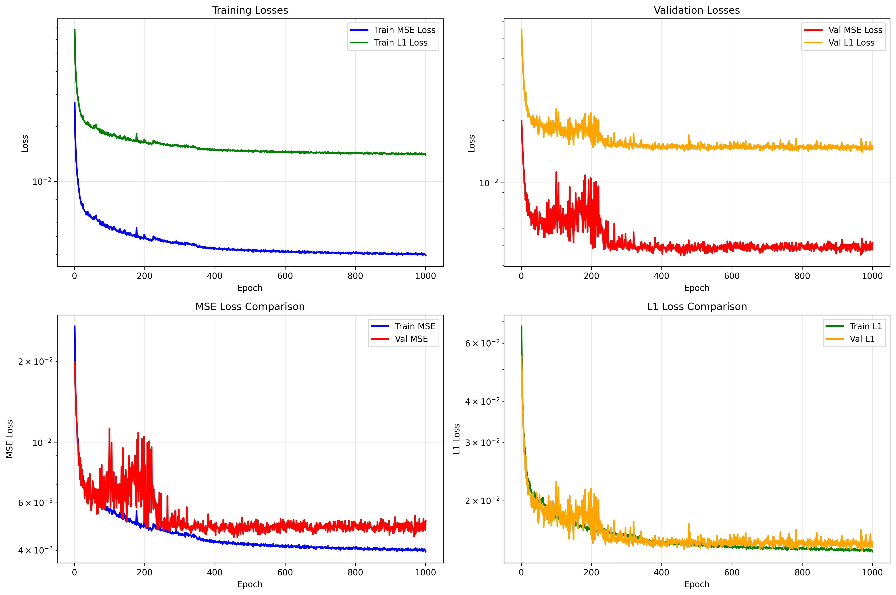

# 计图挑战赛大作业报告 
**BIGMONEY 战队** 
计32 刘昕雨 2023012166
计33 李溪茉 2023012254
计36 郑皓之 2023012168


## 〇、最终排名

截止 2025.6.22 23:00，BIGMONEY 战队排名为 33/100（33.0%）


## 一、任务分析

本赛题旨在基于归一化点云数据，预测其对应的骨架关节点位置和每个顶点的关节控制权重，以支持线性混合形变框架下的骨骼动画建模。
评测流程已由 baseline 提供，整体 pipeline 包括两阶段的骨架预测与权重预测模块。我们所需关注的核心任务是：**在给定的框架下优化模型结构与训练策略，以提升预测精度与泛化能力。**
具体来说，需要：

1. 调整 PCT 网络结构（修改文件：PCT/networks/cls/pct.py）；
2. 优化骨架预测模块（修改文件：models/skeleton.py）；
3. 改进权重预测模块（修改文件：models/skin.py）；
4. 根据模型变化适当调整训练过程中的超参数设置（如学习率、batch size、损失函数权重等）。

**给定的训练集大小是4918，略小**


## 二、baseline 分析

#### 整体思路分析

1. 特征提取模块（pct.py）
   使用 PCT 网络提取点云的全局/局部特征。
   Point_Transformer:

```
Input [B, 3, N]
│
│ 说明：输入点云，每个点为 (x, y, z)，共 N 个点，B 是 batch 大小。
│
▼
[Conv1d (3 → 128)]
│
│ 作用：将每个点的 3D 坐标通过 MLP 投影到 128 维的特征空间，相当于第一层特征提取。
│       也可看作是将几何输入映射为语义特征。
│
▼
[Conv1d (128 → 128)]
│
│ 作用：进一步增强点的特征表示，保持维度不变但提升非线性表达能力。
│       这里两层 Conv1d 等效于一个 2 层 MLP。
│
▼
[SA_Layer × 4] — with Residuals and xyz positional encoding
│
│ 作用：
│   - 每一层都是一个自注意力模块（Self-Attention Layer）
│   - 模仿 Transformer 中的 Q-K-V 架构，让每个点动态聚合其他点的信息（全局或局部）
│   - 残差连接用于稳定训练和增强特征流
│   - 特别地加入了 xyz 的坐标投影作为 **位置编码**，提升模型对空间结构的建模能力
│
▼
[Concat (x1, x2, x3, x4) → 512 channels]
│
│ 作用：
│   - 将 4 层 SA_Layer 的输出（每层都是 [B, 128, N]）进行通道级拼接，得到更丰富的多层语义信息
│   - 融合低层（局部）和高层（全局）特征表示
│
▼
[Conv1d (512 → 1024) + BatchNorm + LeakyReLU]
│
│ 作用：
│   - 使用 1×1 卷积压缩并整合融合后的特征
│   - BatchNorm 保证稳定训练；LeakyReLU 引入非线性增强表达力
│   - 变换为 1024 维的全局特征向量（仍按每个点保留）
│
▼
[MaxPool over N (points)] → [B, 1024]
│
│ 作用：
│   - 对所有点做 **最大池化**，提取全局上下文特征（全局特征汇聚）
│   - 最终保留每个点云的一个 1024 维描述向量（全局语义特征）
│
▼
[MLP: 1024 → 512 → 256 → output_channels]
│
│ 作用：
│   - 三层全连接网络
│   - 每层带有 ReLU、Dropout，提升泛化能力
│
```

   Point_Transformer2(没有在 baseline 中使用):

```
Input [B, 3, N]
│
│ 将 XYZ 坐标按点表示作为初始几何输入
│
▼
[Conv1d (3 → 64) + BN + ReLU]
│
│ 功能：将 3D 坐标映射到 64 维空间，进行初步特征抽象
│
▼
[Conv1d (64 → 64) + BN + ReLU]
│
│ 功能：在同一维度上增强特征表达能力，形成基础 point-wise 表示
│
▼
[Permute (to [B, N, 64])] → sample_and_group(npoint=512, nsample=32)
│
│ 功能：按 512 个采样点做 Farthest Point Sampling（FPS），对每个采样点找到 32 个邻域点
│ 输出：新采样点坐标 `new_xyz` 与其邻域点特征 `new_points`
│
▼
[Local_op(in 128 → out 128)]
│
│ 功能：局部特征提取，将采样邻域的 128 维特征通过两个 Conv1d + BN + ReLU 提取 128 维特征，并对邻域维度做池化聚合
│
▼
[Permute] → sample_and_group(npoint=256, nsample=32)
│
│ 功能：进一步缩小点数量至 256，逐层抽取更大的局部感受野
│
▼
[Local_op(in 256 → out 256)]
│
│ 功能：继续局部特征抽取，并池化获取高维局部表达（256 维）
│
▼
[Point_Transformer_Last]
│
│ 输入特征维度：256，点数：256
│ 功能：类似 `Point_Transformer` 中的多层 SA 层，做 self-attention + 残差 + xyz 位置信息融合，最终输出层特征同样是 4 段拼接
│
▼
[Concat (x, feature_1)], 实质 concat 最后一层注意力输出和 Local_op 特征
│
│ 功能：保留多个通道级别的特征表达，共计 1024 维
│
▼
[Conv1d (1280 → 1024) + BN + LeakyReLU]
│
│ 功能：降低通道维度，融合多源特征为紧凑、高语义的 1024 维表达
│
▼
[MaxPool over N] → [B, 1024]
│
│ 功能：全局汇聚特征，获得点云的整体表示
│
▼
[MLP: Linear(1024 → 512) + BN + ReLU + Dropout (0.5)]
│
│ 功能：构建强表达能力，减少维度并防止过拟合
│
▼
[Linear(512 → 256) + BN + ReLU + Dropout (0.5)]
│
│ 功能：渐变降维，继续缓冲信息表达
│
▼
[Linear(256 → output_channels)]
│
│ 功能：输出最终预测结果
```

2. 骨架关节点预测（skeleton.py）
   使用 Point_Transformer 网络提取全局 shape-level 特征（特征维度为 feat_dim=256）。
   接一个简单的两层 MLP 回归关节点的三维位置。

3. 控制权重预测（skin.py）
   还是使用 Point_Transformer 网络提取点云整体的 shape latent。
   将 shape latent 融合点云顶点位置与骨架位置，分别通过两个 MLP（一个针对点、一个针对关节）提取特征。
   通过注意力机制（点特征 × 关节点特征）生成每个顶点对每个关节的控制权重（softmax）。

#### 主要不足分析

**特征表达不足：骨架和点之间的空间结构弱建模**
skeleton 和 skin 模块都使用了全局 shape latent，但没有显式建模点与关节点之间的几何/空间关系
**这种方法假设所有点和所有关节之间都有关联，不够稀疏，缺少区域性的偏好建模**


## 三、论文阅读

### 1. **PCT: Point Cloud Transformer**

#### (1) 基于坐标的输入嵌入模块（Coordinate-based Input Embedding）

- **问题**：
  传统 Transformer 的位置编码（Positional Encoding）依赖词序，但点云无序且无固定顺序。

- **改进**：
  省略传统的位置编码模块，直接将点坐标作为输入特征（例如 $d_p = 3$），并通过共享的 MLP 层（如两层 `LBR`）生成嵌入特征 $F_e$。

- **优势**：
  点坐标本身已包含空间位置信息，无需额外编码，简化了输入处理并保持排列不变性。

#### (2) 偏移注意力机制（Offset-Attention Module）

- **问题**：
  原始自注意力（Self-Attention）对绝对坐标敏感，且难以捕捉点云的局部几何结构。

- **改进**：

  将自注意力输出 $F_{sa}$ 替换为输入特征与注意力特征的偏移量：

  $$
  F_{out} = \text{LBR}(F_{in} - F_{sa}) + F_{in}
  $$

  归一化优化：

  - 对注意力矩阵 $\tilde{A}$ 先进行 **softmax（行归一化）**；
  - 再按列进行 $\ell_1$ 归一化（详见论文公式 9）。

- **优势**：

  - 偏移操作类似图卷积中的拉普拉斯算子：

    $$
    I - A \approx L
    $$

    增强对刚体变换的鲁棒性；

  - 双归一化过程锐化注意力权重，减少噪声影响。

#### (3) 邻居嵌入模块（Neighbor Embedding for Local Context）

- **问题**：
  单个点缺乏语义信息，全局注意力易忽略局部几何结构。

- **改进**：

  引入层次化局部特征聚合（借鉴自 PointNet++ 和 DGCNN）：

  - **采样**：使用最远点采样（FPS）降低点密度。
  - **分组**：对每个采样点进行 $k$ 近邻搜索（k-NN）。
  - **特征提取**：对邻域点特征进行差值拼接与最大池化处理：

    $$
    \Delta F(p) = \text{concat}(F(q) - F(p))
    $$

    $$
    F_s(p) = \text{MaxPool}(\text{LBR}(\text{LBR}(\Delta F)))
    $$

- **任务适配**：

  - **分类任务**：逐步降采样，例如 1024 → 512 → 256 点。
  - **分割任务**：保持原始点数，仅提取局部特征。

- **优势**：
  显式增强局部几何信息，提升语义分割和细节感知能力（如图 5 所示）。

#### (4) 其他优化

- **特征融合策略**：

  在分割任务中，融合方式如下：

  $$
  F_{fused} = \text{concat}(F_g, F_o, \text{class\_onehot})
  $$

  其中：

  - $F_g$ 为全局特征（MaxPool + AvgPool 拼接）；
  - $F_o$ 为点特征；
  - `class_onehot` 为 64 维 one-hot 编码的类别标签。

### 2. **Point Transformer V3: Simpler, Faster, Stronger**

#### (1) 点云序列化（Point Cloud Serialization）

- **问题**：
  点云的无序性使得 k-NN 搜索耗时大，占 PTv2 前向时间的 28%。

- **改进**：
  使用空间填充曲线（如 `Z-order` 或 `Hilbert`）将无序点云转为有序序列（见图 3），以保持局部性并支持高效块划分。

- **优势**：
  避免实时 k-NN 计算，显著提升运行速度。

#### (2) 序列化注意力（Serialized Attention）

- **向量注意力替换**：
  使用标准 **点积注意力（Dot-Product Attention）** 替代 PTv2 的向量注意力形式，简化计算：

  $$
  \text{Attention}(Q, K, V) = \text{Softmax}\left(\frac{QK^T}{\sqrt{d_k}}\right)V
  $$

- **块交互机制**：

  - 引入 `Shift Order` + `Shuffle Order`（见图 5d）；
  - 循环切换 `Z-order → Hilbert` 等序列化方式，提升表示多样性；
  - 替代复杂的 `Shift Window` 和 `Shift Dilation`，减少内存占用。

- **位置编码优化**：

  - 移除相对位置编码（RPE，占 PTv2 的 26% 耗时）；
  - 使用前置稀疏卷积层（xCPE）替代，实现性能与效率平衡。

#### (3) 感受野规模化（Receptive Field Scaling）

- **感受野扩展**：

  - 将感受野从 PTv2 的 16 ～ 32 点，提升至 1024 点甚至 4096 点；
  - 突破传统点云 Transformer 感受野限制。

- **效率保障**：
  序列化设计保证感受野扩大时的耗时和显存增加可忽略。


## 四、改进方案

### 0. Enhanced Point Transformer

本试验为早期探索阶段进行，性能可达到 62.2486 分，在此不过多阐释：


### 1. Skeleton & Skin Point Transformer

分为 pct_skeleton.py 和 pct_skin.py 两个文件，分别实现了不同的模型架构

#### SkeletonTransformer:

1. 多层卷积特征提取：模型以原始点云坐标 `[B, 3, N]` 为输入，通过多层 `Conv1d → BN → ReLU` 逐步提取从低维到高维的几何特征，最终将每个点嵌入到 256 维空间中。
   
2. 多层自注意力模块（SA_Layer ×4）：核心模块由 4 层自注意力组成，每层包括特征投影、位置编码、QKV 注意力机制及残差连接，用于建模点之间的全局关系并增强结构感知能力。
   
3. 全局特征聚合与分类头：将注意力模块输出进行融合，利用 Max Pooling 获取全局特征，扩展后与局部特征拼接，通过分类头（由卷积+Dropout 组成）输出每个点云的类别预测 `[B, num_classes]`。

```
Input: [B, 3, N]                                # 原始点云 xyz 坐标
│
▼
Conv1d(3 → 64) → BN → ReLU                     # 初始特征嵌入：将点云几何坐标转换为特征表示
│
▼
Conv1d(64 → 64) → BN → ReLU                    # 特征增强
│
▼
Conv1d(64 → 128) → BN → ReLU                   # 特征维度提升
│
▼
Conv1d(128 → 256) → BN → ReLU                  # 高维特征抽取
│
▼
┌──────────────────────────────────────────────────────┐
│ SA_Layer ×4                                          │  # 自注意力层堆叠
│ ├─ k: [64, 64, 64, 64]                               │  # 特征投影维度
│ ├─ Linear(256 → k)                                   │  # 输入特征线性投影
│ ├─ Position Encoding                                 │  # sin-cos 位置编码
│ ├─ QKV Self-Attention                                │  # QKV 注意力计算
│ ├─ Fusion: Attention × PosEnc                        │  # 特征融合
│ └─ Residual + LayerNorm                              │  # 残差连接与归一化
└──────────────────────────────────────────────────────┘
│
▼
conv_fuse                                           # 多层特征融合层
├─ Fuse outputs from 4 SA_Layers                    # 融合四个 SA 层的输出特征
├─ Conv1d → BN → ReLU                               #
└─ Output shape: [B, 256, N]                        # 得到融合特征表示
│
▼
Max Pooling over N                                  # 全局特征提取 → [B, 256, 1]
│
▼
Feature expansion + concat                          # 特征扩展与拼接
├─ Expand to [B, 256, N]                            # 全局特征扩展
├─ Concat with point features → [B, 512, N]         # 拼接成联合特征
│
▼
┌──────────────────────────────────────────────────────┐
│ Classification Head                                  │
│ ├─ Conv1d(512 → 256) → BN → ReLU                     │
│ ├─ Dropout(0.5)                                      │
│ ├─ Conv1d(256 → 256) → BN → ReLU                     │
│ ├─ Dropout(0.5)                                      │
│ └─ Conv1d(256 → output_channels)                     │
└──────────────────────────────────────────────────────┘
│
▼
Output: [B, num_classes]                          # 点云分类结果

```

#### SkinTransformer:

1. 点云特征提取与自注意力建模：模型首先通过多层卷积（Conv1d + BN + ReLU）将点云几何信息编码为高维特征，随后堆叠 4 层自注意力模块（SA_Layer ×4），引入位置编码并建模点之间的全局关系，提升对局部结构的理解能力。
   
2. 类别信息引入与特征融合：网络引入物体类别标签作为额外输入，通过卷积嵌入为 `[B, 64, N]` 的特征，与局部点特征和全局特征一起拼接为 `[B, 576, N]`，显式加强语义引导，有助于实现更准确的点级分割。
   
3. 分割头逐点预测部件类别：拼接后的特征通过多层卷积和 Dropout 构成的分割头进行逐点分类，输出 `[B, num_part_classes, N]`，实现每个点的部件级语义预测，适用于如 ShapeNet 等分割任务。

```
Input: [B, 3, N] + [B, 1]                          # 原始点云坐标 + 类别标签
│
▼
Conv1d(3 → 64) → BN → ReLU                        # 初始特征嵌入
│
▼
Conv1d(64 → 64) → BN → ReLU                       # 特征增强
│
▼
Conv1d(64 → 128) → BN → ReLU                      # 特征维度提升
│
▼
Conv1d(128 → 256) → BN → ReLU                     # 高维特征抽取
│
▼
┌──────────────────────────────────────────────────────┐
│ SA_Layer ×4                                          │  # 自注意力层
│ ├─ k: [64, 64, 64, 64]                               │  # 特征投影维度
│ ├─ Linear(256 → k)                                   │  # 输入特征投影
│ ├─ Position Encoding                                 │  # sin-cos 坐标编码
│ ├─ QKV Self-Attention                                │  # 注意力机制
│ ├─ Attention + PosEnc Fusion                         │  # 注意力与位置编码融合
│ └─ Inter-layer Feature Connection                    │  # 层间特征连接
└──────────────────────────────────────────────────────┘
│
▼
conv_fuse                                              # 多层特征融合
├─ Fuse SA_Layer outputs → [B, 256, N]                # 融合后特征
│
▼
Label Embedding                                        # 类别标签处理
├─ label_conv → [B, 64, N]                            # 类别标签嵌入为特征
│
▼
Max Pooling over N                                     # 全局特征提取 → [B, 256, 1]
│
▼
Feature Concatenation                                  # 特征拼接
├─ Global features expanded: [B, 256, 1] → [B, 256, N] #
├─ Local features: [B, 256, N]                         #
├─ Label features: [B, 64, N]                          #
├─ Concat: [B, 576, N]                                 # 拼接为联合特征
│
▼
┌──────────────────────────────────────────────────────┐
│ Segmentation Head                                    │
│ ├─ Conv1d(576 → 256) → BN → ReLU                     │
│ ├─ Dropout(0.5)                                      │
│ ├─ Conv1d(256 → 256) → BN → ReLU                     │
│ ├─ Dropout(0.5)                                      │
│ └─ Conv1d(256 → num_part_classes)                    │
└──────────────────────────────────────────────────────┘
│
▼
Output: [B, num_part_classes, N]                  # 每个点的部件类别预测结果

```

### 2. Point_Transformer2 Enhanced

相比原始的 Point_Transformer，Point_Transformer2 在结构设计上进行了显著的改进。首先，它引入了层次化的采样与邻域聚合机制（Sample and Group），使得网络能够更加高效地建模点云的局部几何结构。其次，Point_Transformer2 结合了局部特征提取（Local_op）与全局上下文建模（Point_Transformer_Last），有效融合了不同尺度的语义信息。所以我对原始的 Point_Transformer2 做出了一些改进，用于 skeleton 和 skin 的预测
我做出的改进有：

1. 引入多头注意力机制（Multi-Head Self-Attention）：我使用了 MultiHeadSA_Layer，并将其替换到了 Point_Transformer_Last 中的四个注意力模块（sa1~sa4）。每个头独立进行注意力计算后拼接，有助于捕捉特征的多样性与不同的空间关系，提升模型表达能力。
2. 可学习的位置编码（Learnable Positional Encoding）：原始模型的空间位置通过 xyz_proj 进行线性映射后直接加到特征上，我引入了 多层感知机（pos_mlp）来生成位置编码，使位置嵌入更具表达性并可学习。
3. 注意力权重和特征 Dropout（增强正则化）：增强了鲁棒性

### 3. PCTv3 v1:

我在学习的过程中找到了对 PointTransformer 的改进版的论文：Point Transformer V3（第三部分的第二篇论文），于是针对 jittor 框架对其进行了适配和简化，采用在了 skeleton 和 skin 的预测上。
架构如下：

```
Input: [B, 3, N]                     # 原始点云 xyz 坐标
│
▼
Conv1d(3 → 64)                      # 初始特征嵌入：将几何输入映射为64维语义空间
│
▼
┌────────────────────────────────────────────┐
│ Stage 1: Encoder ×2                        │  # channels = 64
│ ├─ PTv3Block                               │
│ │  ├─ xcpe(xyz→64)                         │  # 坐标位置编码卷积
│ │  ├─ create_patches                       │  # 将点特征划分为局部 patch
│ │  ├─ SerializedAttention                  │  # patch 内 QKV 注意力
│ │  ├─ FFN: Conv1d + ReLU + Conv1d          │
│ │  └─ Residual: Input + Attention + FFN    │  # 残差连接
└────────────────────────────────────────────┘
│
▼
Downsample: Conv1d(64 → 128)        # 提升通道数，模拟下采样
│
▼
┌────────────────────────────────────────────┐
│ Stage 2: Encoder ×2                        │  # channels = 128
│ ├─ PTv3Block ×2                            │  # 同结构，提取更深语义特征
└────────────────────────────────────────────┘
│
▼
Downsample: Conv1d(128 → 256)       # 通道上升，感受野变大
│
▼
┌────────────────────────────────────────────┐
│ Stage 3: Encoder ×6                        │  # channels = 256
│ ├─ PTv3Block ×6                            │  # 深层注意力，捕捉全局结构信息
└────────────────────────────────────────────┘
│
▼
Downsample: Conv1d(256 → 512)       # 最后一次通道提升
│
▼
┌────────────────────────────────────────────┐
│ Stage 4: Encoder ×2                        │  # channels = 512
│ ├─ PTv3Block ×2                            │  # 高层抽象语义建模
└────────────────────────────────────────────┘
│
▼
Global Max Pooling over N           # 聚合全局点特征 → [B, 512]
│
▼
┌──────────────────────────────────────────────────────────────┐
│ MLP Head: Classification Module                              │
│ ├─ Linear(512 → 512) + ReLU + Dropout(0.5)                   │
│ ├─ Linear(512 → 256) + ReLU + Dropout(0.5)                   │
│ └─ Linear(256 → output_channels)                             │
└──────────────────────────────────────────────────────────────┘
│
▼
Output: [B, output_channels]        # 每个点云样本的分类结果

```

### 4. PCTv3 v2：

通过对 PCTV3 论文的学习，进行了另一组与 PCTV3 v1 相平行的 PCTv3 v2 实现：

```
Input: [B, 3, N]                     # 原始点云 xyz 坐标
│
▼
┌────────────────────────────────────────────┐
│ Stem: Initial Feature Extraction           │
│ ├─ Conv1d(3 → 32) + BatchNorm + ReLU       │  # 几何特征初始化
│ ├─ Conv1d(32 → 64) + BatchNorm + ReLU      │  # 特征维度扩展
│ └─ Conv1d(64 → 128) + BatchNorm + ReLU     │  # 128维语义空间映射
└────────────────────────────────────────────┘
│
▼
┌────────────────────────────────────────────┐
│ Stage 1: Encoder ×2                        │  # channels = 128, N points
│ ├─ PTv3TransformerBlock ×2                 │
│ │  ├─ xCPE(xyz→128)                        │  # 条件位置编码：Conv1d(3→64→128)
│ │  ├─ PatchAttention(patch_size=128)       │  # 大patch注意力，捕获局部结构
│ │  │  ├─ patch_partition → QKV attention   │  # 将点云分割为128大小的patch
│ │  │  └─ ShiftPatchInteraction             │  # Shift操作增强patch交互
│ │  ├─ MLP: Conv1d(128→512→128) + GELU      │  # 前馈网络，mlp_ratio=4
│ │  └─ Residual: BatchNorm + Skip Connect   │  # 双重残差连接
└────────────────────────────────────────────┘
│
▼
Downsample: Conv1d(128 → 256) + GridPool(/2)  # 通道翻倍 + 点数减半
│
▼
┌────────────────────────────────────────────┐
│ Stage 2: Encoder ×2                        │  # channels = 256, N/2 points
│ ├─ PTv3TransformerBlock ×2                 │
│ │  ├─ xCPE(xyz→256)                        │  # 更高维位置编码
│ │  ├─ PatchAttention(patch_size=64)        │  # 中等patch，平衡局部与全局
│ │  ├─ MLP: Conv1d(256→1024→256) + GELU     │
│ │  └─ Residual + BatchNorm                 │
└────────────────────────────────────────────┘
│
▼
Downsample: Conv1d(256 → 512) + GridPool(/2)  # 进一步提升语义抽象
│
▼
┌────────────────────────────────────────────┐
│ Stage 3: Deep Encoder ×6                   │  # channels = 512, N/4 points
│ ├─ PTv3TransformerBlock ×6                 │  # 深层语义建模
│ │  ├─ xCPE(xyz→512)                        │  # 高维条件位置编码
│ │  ├─ PatchAttention(patch_size=32)        │  # 小patch，精细特征提取
│ │  │  ├─ MultiHead SelfAttention (8 heads) │  # 多头注意力捕获复杂关系
│ │  │  └─ Shift Patch Interaction           │  # 增强patch间信息流动
│ │  ├─ MLP: Conv1d(512→2048→512) + GELU     │  # 大容量前馈网络
│ │  └─ Residual + BatchNorm                 │
└────────────────────────────────────────────┘
│
▼
Downsample: Conv1d(512 → 512) + GridPool(/2)  # 保持通道数，空间压缩
│
▼
┌────────────────────────────────────────────┐
│ Stage 4: High-Level Encoder ×2             │  # channels = 512, N/8 points
│ ├─ PTv3TransformerBlock ×2                 │  # 高层抽象语义建模
│ │  ├─ xCPE(xyz→512)                        │  # 最终位置编码
│ │  ├─ PatchAttention(patch_size=16)        │  # 最小patch，全局信息聚合
│ │  ├─ MLP: Conv1d(512→2048→512) + GELU     │
│ │  └─ Residual + BatchNorm                 │
└────────────────────────────────────────────┘
│
▼
Global Average Pooling over N/8      # 手动实现：jt.mean(x, dim=2) → [B, 512]
│
▼
┌──────────────────────────────────────────────────────────────┐
│ Final MLP Head: Skeleton Prediction Module                   │
│ ├─ Linear(512 → 512) + BatchNorm + ReLU + Dropout(0.3)       │  # 特征精炼
│ └─ Linear(512 → output_channels)                             │  # 骨骼参数预测
└──────────────────────────────────────────────────────────────┘
│
▼
Output: [B, output_channels]          # 骨骼预测结果（默认256维）

```

1. 分阶段特征提取与空间结构编：我使用了四阶段编码器逐层提取点云语义特征，通道维度从 128 逐步提升至 512，每阶段均采用 Patch Attention 与 Shift Patch Interaction 构建局部-全局融合的空间关系，同时配合 xCPE 条件位置编码实现几何与语义的高效耦合。
   
2. 高效下采样与全局信息建模：在各阶段之间，通过 Grid Pooling 进行规则下采样，在保持空间结构均匀性的同时压缩计算开销，最终使用 Global Average Pooling 对深层特征进行全局聚合，为后续的骨架参数预测提供稳定、抽象的高维表示。
   
3. 骨架参数回归模块实现精确预测：汇聚后的全局特征通过两层全连接网络组成的回归头（带 BN、ReLU、Dropout）输出 `[B, output_channels]` 的骨架参数，具备结构感知性强、鲁棒性高的特点，适用于精细化的人体或物体骨架建模任务。


## 五、实验结果

1. Skeleton & Skin Point Transformer

   超参数设置：两个任务的 learning rate 均是 5e-5，batch_size 设置是 24


2. Skeleton Point Transformer & Point_Transformer2 Enhanced

   超参数设置：两个任务的 learning rate 均是 5e-5，batch_size 设置是 24
   
   
   
   约在七八百 epochs 处收敛

3. PCTV3 v1

   超参数设置：skeleton 的 learning rate 是 1e-5，skin 的 learning rate 是 1e-4，batch_size 设置是 16
   
   
   约在六七百 epochs 处收敛
   因为这个曲线明显不如前面两种方案好，故没有提交至平台进行测试

4. PCTV3 v2

   超参数设置：skeleton 的 learning rate 是 5e-5，skin 的 learning rate 是 5e-5，batch_size 设置是 16
   
   
   效果不佳，没有提交至平台

5. Skeleton & Skin Point Transformer

   多参数实验：

   |组别| skeleton 参数 | skeleton 曲线 |skin 参数 | skin 曲线 |
   |----------------|-----------------|-----------------|---------------|----------|
   |1| batch_size：16 <br> epochs：1500 <br> learning_rate：0.00005 |  |batch_size：16 <br> epochs：1500 <br> learning_rate：0.00005 |  |
   |2| batch_size：16 <br> epochs：1000 <br> learning_rate：0.0001 |  | batch_size：16 <br> epochs：1000 <br> learning_rate：0.0001 | |
   |3| batch_size：24 <br> epochs：1500 <br> learning_rate：0.00005 |  |batch_size：24 <br> epochs：1500 <br> learning_rate：0.00005 |  |
   |4 | batch_size：24 <br> epochs：1000 <br> learning_rate：0.0001 |  |batch_size：24 <br> epochs：1000 <br> learning_rate：0.0001 | |

6. Point_Transformer2 Enhanced

   Scale up，Transformer block堆到6层
   超参数设置：skeleton 的 learning rate 是 1e-5，skin 的 learning rate 是 1e-4，batch_size 设置是 16
   
   
   看起来效果尚佳，但是测试集上的loss大跌眼镜，过拟合了

7. Skeleton & Skin Point Transformer：
   超参数设置：skeleton 的 learning rate 是 5e-5，skin 的 learning rate 是 5e-5，batch_size 设置是 16
   
   
   验证集上可以看出过拟合了


## 六、实验结果分析

### 架构对模型性能的影响（做消融实验的cost过大，故分析较为宏观）

Skeleton & Skin Point Transformer：

1. 更深的多层卷积特征提取（Conv1d 3→64→64→128→256）
原理：
逐层扩展特征维度，**相当于逐渐从低层几何信息中学习出更加复杂的语义特征。**

- 性能提升点：
  深层网络 = 更强的表示能力，能学习更复杂的点云局部几何模式。
  每层都有 BN+ReLU，有助于梯度流动与训练稳定。
  抑制了原始两层 Conv1d 提取不足、特征维度不足带来的表达瓶颈。

2. 更标准、更稳定的 Transformer 架构（SA_Layer 改进）
原理：
将自注意力模块从 PCT 的“简化版”升级为**更接近标准 Transformer**的 Q-K-V + sin-cos 位置编码 + LayerNorm 结构。

- 性能提升点：
  QKV 显式学习表示之间的关系，增强了点间的依赖建模能力（非局部建模）。
  sin-cos 位置编码优于 xyz 直接映射，在空间建模中更具有归纳偏置（与 NLP/ViT 一致）。
  残差连接 + LayerNorm 提高深层训练稳定性，防止退化和梯度爆炸/消失。
  整体注意力模块表达能力增强，对复杂结构（如空心物体、非均匀点）更敏感。

3. 全局特征与局部特征融合策略（Global + Local Feature Fusion）
原理：
不是只用 MaxPool 提取全局语义，而是将其**与局部特征联合拼接，强化点的上下文感知**。

- 性能提升点：
  每个点不仅看自己的局部特征，还能“看到全局”，提升了分类/分割的判别能力。
  特别对结构相似但语义不同的类别有更好区分能力。

4. 改进后的输出结构（Conv1d + Dropout 替代 MLP）
原理：
**全连接层替换为 Conv1d + Dropout**，具备空间共享参数的能力，且更轻量。

- 性能提升点：
  Conv1d 本质上是 1×1 卷积，可视为 MLP 的高效实现，但支持批处理更好。
  Dropout 提升泛化能力，防止过拟合。
  整体减少参数、提升训练稳定性与效率。

5. 引入多头注意力机制（Multi-Head Self-Attention）
   原理对比：
   原始 Point_Transformer2 中每层注意力模块只使用 单一头（Single-Head），这种方式只能从一个角度建模点之间的关系。
   改进后使用 **Multi-Head Self-Attention**，每个头独立学习不同的注意力权重。

- 性能提升原因：
  多头机制 = 多视角捕捉点间的空间关系，每个头可以关注不同的局部或非局部结构特征。
  能够更好地捕捉复杂空间结构，如物体的对称性、细节区域等。
  与自然语言处理中的 Transformer 一样，多头机制是扩展表示力的核心手段。
  对于点云这样结构不规则、不连续的数据，Multi-Head Attention 更能适应其多样性和非均匀性。

6. 可学习的位置编码（Learnable Positional Encoding）
   原理对比：
   原始 Point_Transformer2 使用的是简单的 xyz 坐标线性映射（xyz_proj）作为位置偏置。
   改进后使用一个**MLP（pos_mlp）**从点间相对位置学习更复杂的位置嵌入。

- 性能提升原因：
  xyz_proj 是一个静态、线性的映射，学习能力有限，可能无法充分建模复杂的空间分布。
  Learnable Position Embedding 通过非线性 MLP 可以捕捉更复杂的空间关系（如非欧几里得结构、曲面内邻接关系）。
  相当于从「生硬的几何偏置」→「可学习的几何表达」，更具灵活性和适应性。
  在形状、密度变化大的数据集（如 ScanNet、ShapeNetPart）中尤为重要。
  提升了模型的空间感知能力，让注意力更精准地聚焦在具有语义意义的位置上。

7. 注意力权重和特征 Dropout（增强正则化）
   原理对比：
   改进在注意力机制中加入 Dropout，对注意力得分矩阵和中间特征进行随机失活。

- 性能提升原因：
  减少模型依赖特定注意力路径，降低过拟合风险。
  让注意力机制在训练时更具有泛化性，对不同点云扰动具有更强鲁棒性。

#### 两个PTV3改进相比于前面两个改进的负优化分析
1. 任务适配性不足
问题点：
Point Transformer V3 原本是为点云分类、语义分割任务设计的通用结构，它注重提取全局语义。
而 skeleton 和 skin 预测是结构回归任务，更强调精细的空间结构与几何连贯性，对局部结构保留要求非常高。

- 结果影响：
  **PCTv3 多次下采样、特征抽象太强，导致局部几何信息丢失严重，不适合这种需要精细回归的任务**。
  复杂全局建模反而带来了噪声与过度拟合，不利于细节特征保留。

2. 模型过重、特征过深
问题点：
两个版本都采用了多个 Stage，每层还有大 MLP（例如 512→2048）。
通道数从 64→128→256→512，模型规模指数级增长，参数量和计算复杂度极高。

- 结果影响：
  对于小规模任务（如骨架预测的数据集通常较小），模型容量严重过大，训练不充分，导致欠拟合或梯度不稳定。
  学习过程难以收敛或陷入局部最优，精度下降。
  反而不如前面那些轻量级模型（结构浅、局部增强）来的有效。

3. 过多的 Patch 划分和 Shift 操作引入噪声
问题点：
PCTv3 的核心机制是划分 Patch（128 → 64 → 32 → 16）+ Shift Patch Interaction。
对点云不断划分、重组，试图增强局部到全局的信息流动。

- 结果影响：
  在语义分割这类类别稳定的任务中，这种方法有利。
  但**在结构预测任务中，它会打乱原始几何结构的连续性，导致结果“不光滑”、“跳跃性强”。**
  skeleton 的连续性和 skin 的形变依赖于稳定的局部邻域，这种打散式 patch 操作会破坏空间一致性。

4. 条件位置编码过于复杂且训练不足
问题点：
所谓的 xCPE（条件位置编码）实际上是一个深度感知位置的卷积网络。
它并非简单相对位置，而是尝试用多层感知结构建模位置编码。

- 结果影响：
  在数据量小、任务结构明确（如骨架预测）中，这种复杂位置编码反而学不到通用的位置偏置。
  **模型训练不充分时，xCPE 会给注意力引入不稳定的几何信号**，影响最终精度。


#### scale up的负优化分析
问题点1：数据不够，但是模型很大，于是过拟合
问题点2：推测验证集的分布与训练集的分布较为接近，与测试集的分布则较为不同，导致我在训完之后**有了性能提升的错觉**

### 超参数对模型性能的影响分析
#### learning rate
| 比较维度         | Skeleton     | Skin      | 说明                             |
| ------------ | ------------ | --------- | ------------------------------ |
| 回归目标复杂度      | 高（结构连续、几何嵌套） | 中（每点独立回归） | Skeleton 需要精细建模几何关系            |
| 损失 landscape | 非凸、不平滑       | 相对平滑      | Skeleton 在 loss surface 中更容易震荡 |
| 对学习率的容忍度     | 低            | 高         | Skeleton 不能用太大步长，否则无法收敛        |

原始学习率就是一个很强的配置（skeleton 1e-5，skin 1e-4）

#### batch size
本次实验尝试了16和24两种batch size（采用过小的batch size训练时间过长，过大的batch size太吃显存，batch size 24只能在A100上跑），发现性能差别不大。
不过理论上，小batch size的效果更好，泛化能力更强。

#### epoch
训练时epoch统一设置为1000epoch，一般600-800个epoch收敛

#### optimizer
浅浅尝试过RMSProp（维护每个参数梯度平方的指数加权移动平均），不如adam（一阶矩估计 + 二阶矩估计）
还尝试过Lion（使用符号梯度sign of momentum来指导参数更新），但是jittor框架中没有实现，自己实现之后debug困难，故放弃。


## 七、一些心得和感想

1. **Dropout 不能乱设，加 Dropout 太多会underfit，显著降低得分**
2. A100 的训练速度竟然不如 4090，始终没有想明白是为什么
3. **jittor 下一步应该跟进支持多卡训练，否则训练的速度太慢，一训训一天**
4. 感觉best_model.pkl的选取并不完美（看验证集效果，但见前文：感觉验证集和训练集的分布较为接近，与测试集的分布则较为不同），但是暂时想不到其余的办法
5. 我从同学处得知了还可以进行**数据增强**的操作，但是没有琢磨出来怎么干
6. 比较遗憾，我没有来得及使用**可视化**来对模型进行调整
7. 每天提交次数限制两次增加了模型训练的难度，训练后无法直接在本地计算与分数相关的 loss
8. 投身于大作业的时间大约为两周，可惜没有把分数提得更高，有点遗憾，不过这让我进一步认识到了模型训练的困难
9. 听说其他同学用ptv3的改进冲到了75分，十分想知道他们是如何实现的


## 八、实验分工

郑皓之：
1. 实验初期架构探索，多种架构的初期研究，同时为实验框架引入 loss 曲线绘制与多参数调节
2. 实现三种改进方案：Enhanced Point Transformer（对 PointTransformer2 的改进，探索较早期，并未列出于实验报告中，实测可达到 62.2486 分），Skeleton & Skin Point Transformer，阅读论文并实现 PointTransformerV3
3. 实验调参
4. 检查完善实验报告

刘昕雨：
1. 查找并阅读两篇实验相关的论文
2. 设计两种改进方案：PointTransformer2的改进和PointTransformerV3在jittor框架中的适配实现
3. 进行实验调参，主要测试了epoch、batch size、learning rate和optimizer等超参数对模型性能的影响
4. 将代码进行整理后开源到Gitlink和GitHub上
5. 撰写实验报告的主要框架与主体内容

李溪茉：

1. 探索并梳理多尺度分层框架结构，形成可复用的设计思路
2. 进行多参数实验：系统评估 epoch、batch size、learning rate、optimizer 等超参数对模型性能的影响
3. 实验报告撰写：完成模型架构分析与图表整理，并对报告排版细节进行优化
4. 开源前对项目代码进行完善与整理


## 九、开源网址
github：https://github.com/WilmaLiu2005/jittor-BIGMONEY-jittor_comp_human.git
gitlink：https://gitlink.org.cn/VinceLiu/skeleton_skin.git
